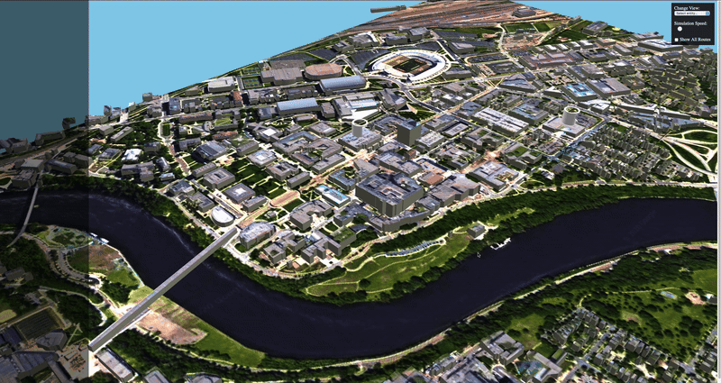
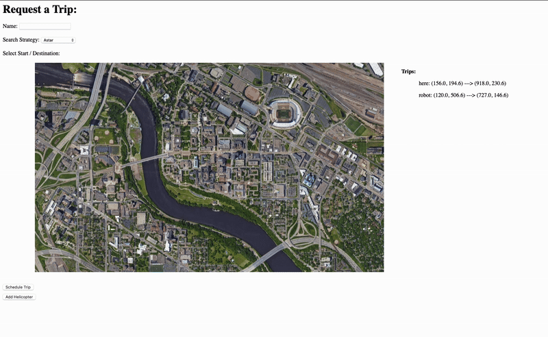
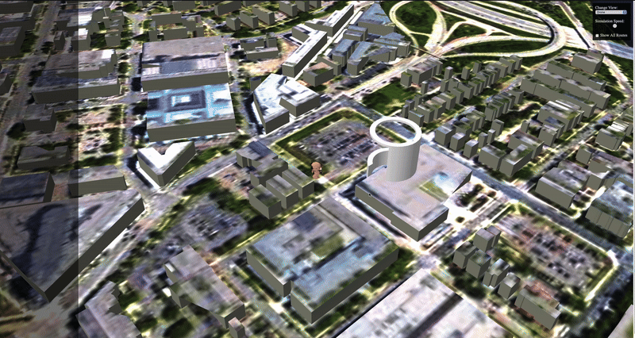

# Project - Drone Simulation System

In this project, we simulate the behavior of autonomous drones and delivery robots within a 3D environment. Users can schedule deliveries, observe drone navigation, rerouting to charging stations, and successful delivery of passengers/robots to final destinations.

This directory contains all the support code needed to visualize the drone simulation system, including navigation algorithms, entity rendering, and the web interface.

---

## 📁 What’s in this Directory?

- `README.md`
- `.gitignore`
- `app/`
  - `graph_viewer/` – Graph rendering for navigation
  - `transit_service/` – Web-based 3D visualization
- `libs/`
  - `routing/` – Core pathfinding logic (A*, Dijkstra's, DFS)
  - `transit/` – Entity behaviors, battery management, delivery system
- `dependencies/` – External libraries and modules

---

## 🛠 Getting Started

```bash
# Go to the project directory
cd /path/to/repo/project

# Build the project
make -j

# Run the project (./build/web-app <port> <web folder>)
./build/bin/transit_service 8081 apps/transit_service/web/
```

Then open your browser:
- 🌐 http://127.0.0.1:8081 → 3D visualization
- 🌐 http://127.0.0.1:8081/schedule.html → Schedule trip page

Or use Docker:
```bash
docker run -it --rm -p 8081:8081 abdinahmen/team-010-31-project:latest
```

---

## ✨ Simulation Features

### 📍 1. Map View
> 
> 
Displays the environment where drone and robot deliveries are scheduled and executed.

### 📅 2. Schedule Page
> 

Users can input the passenger’s name, select pickup and drop-off points, and initiate trips.

### 🚁 3. Drone Flying
> 

Visualizes the autonomous drone navigating through the environment.

### ⚡ 4. Drone Rerouting to Charging Station
> 

Drones intelligently reroute to charging stations when battery thresholds are reached.

### ✅ 5. Drone Delivery Complete
> 

Drones successfully drop off passengers at their final destination.

> 💡 Each view showcases different aspects of routing algorithms, design patterns, and drone AI behavior.

---

## 🎥 Video Presentation
Coming soon...

---

## 👀 3D Visualization
Visit `http://127.0.0.1:8081` to access the 3D drone simulation interface. 
Use the top-right dropdown to change camera views and follow entities.

To schedule new trips, visit `http://127.0.0.1:8081/schedule.html`.

---

## 🧱 Tech Stack & Architecture
- **Languages**: C++, JavaScript, HTML, CSS
- **Design Patterns**: Decorator, Factory
- **Visualization**: WebGL 3D viewer
- **Build Tools**: Make, Docker

---

## 🐳 Docker Quick Run
```bash
docker run -it --rm -p 8081:8081 abdinahmen/team-010-31-project:latest
```

---

Want to contribute or test new navigation features? Open an issue or submit a PR! 🚀
